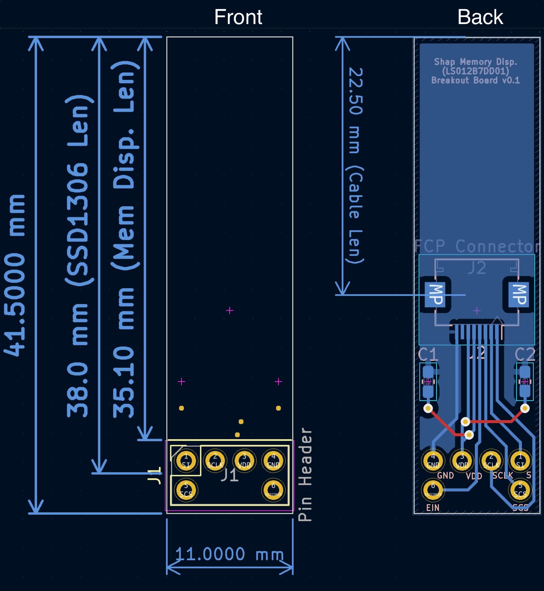

# Sharp Memory Display Breakout Board for LS012B7DD01

The purpose of this board is to provide a near-drop-in low-power display replacement for the popular SSD1306 128x32 OLED.

It is meant to be used in wireless ergo split keyboards such as the [sofle](https://github.com/josefadamcik/SofleKeyboard) and [corne](https://github.com/foostan/crkbd).

> :warning: **Warning:**
>
> This board has not been tested yet.

## Credits

- Crehmann and [his breakout board for LS011B7DH03](https://github.com/crehmann/Sharp-Memory-LCD-Breakout), which I used as a reference and from which I drew a lot of inspiration
- Jon808517 [and his board](https://discord.com/channels/719497620560543766/785533287049330729/964635218940141569), which lead me to pursue this project
- All of the super helpful guys on the ZMK discord who patiently answered all my questions

## Related Projects

- [crehmann/Sharp-Memory-LCD-Breakout](https://github.com/crehmann/Sharp-Memory-LCD-Breakout)
- [karnadii/sharp_memory_display_breakout](https://github.com/karnadii/sharp_memory_display_breakout)
- [adafruit/Adafruit-Sharp-Memory-Display-PCBs](https://github.com/adafruit/Adafruit-Sharp-Memory-Display-PCBs)
